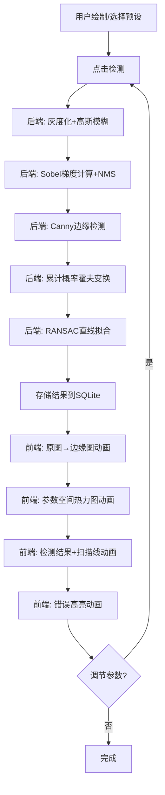

## 1. 产品概述

极坐标霍夫变换参数空间可视化系统——一个交互式车道线检测教学与演示平台，让用户直观理解霍夫变换在车道线检测中的原理、优势与局限性。用户可在画布上绘制含弯道、虚线、遮挡的道路图像，系统实时执行累计概率霍夫变换与 RANSAC 直线拟合，并通过多种动画逐层展示算法的每一步过程。

- 目标用户：计算机视觉学习者、自动驾驶算法研究者、高校教学演示
- 核心价值：将抽象的参数空间投票过程可视化，展示霍夫变换在复杂道路场景中的失效模式

## 2. 核心功能

### 2.1 功能模块

1. **绘图画布页**：手绘道路图像、加载预设场景、触发检测流程
2. **可视化面板**：四层状态切换（原图→边缘图→参数空间热力图→检测结果）+ 多种动画叠加
3. **参数控制台**：调节霍夫变换阈值、RANSAC 参数、非极大值抑制窗口等

### 2.2 页面详情

| 页面名称 | 模块名称 | 功能描述 |
|---------|---------|---------|
| 主页面 | 绘图画布 | 用户可在 Canvas 上自由绘制道路场景（支持直线、弯道、虚线、阴影遮挡），提供橡皮擦、清空、线宽调节等工具 |
| 主页面 | 预设场景按钮 | 四个预设按钮：①强烈阴影遮盖车道线 ②路面裂缝被误检为车道线 ③曲率半径<50m急弯 ④多车道合并与分流区域标记线 |
| 主页面 | 状态切换动画 | 原图→边缘图→参数空间热力图→检测结果 逐层淡入淡出切换，每层有过渡动画 |
| 主页面 | 粒子动画 | 参数空间中每个(ρ,θ)单元以粒子亮度表示得票数，高票粒子更亮更大 |
| 主页面 | 热力图变化动画 | 参数空间峰值区域从冷色渐变为红热色，动态展示投票累积过程 |
| 主页面 | 扫描线动画 | 沿检测到的直线逐像素验证，一条光带沿线段移动 |
| 主页面 | 错误高亮动画 | 误检的直线持续红色闪烁，警示算法失效 |
| 主页面 | 参数控制台 | 可调参数：Canny高低阈值、霍夫投票阈值、RANSAC迭代次数与距离阈值、NMS窗口大小 |
| 主页面 | 数据面板 | 显示当前检测到的线段参数(ρ,θ)列表，以及投票累加器矩阵的峰值排名 |
| 主页面 | 失效模式注释 | 在可视化中标注：弯道处虚假投票点聚集、虚线车道线断裂、阴影边缘误检、透视畸变导致平行线不平行 |

## 3. 核心流程

用户打开系统 → 选择预设场景或手动绘制 → 点击"检测"按钮 → 后端执行：灰度化→高斯模糊→Sobel梯度计算→非极大值抑制→Canny边缘检测→累计概率霍夫变换→RANSAC直线拟合 → 前端依次播放四层状态切换动画 → 叠加粒子/热力图/扫描线/错误高亮动画 → 用户可调节参数重新检测 → 检测结果存入SQLite

## 4. 用户界面设计

### 4.1 设计风格

- 主色调：深色科技风（#0a0e17 深蓝黑底色），强调色用 #00e5ff 电光蓝 和 #ff3d00 警告红
- 按钮：圆角微光边框，悬停发光效果
- 字体：JetBrains Mono（代码/数据）+ Noto Sans SC（中文UI）
- 布局：左侧大画布区域，右侧参数控制与数据面板，底部预设按钮栏
- 图标：线条式科技感图标

### 4.2 页面设计概览

| 页面名称 | 模块名称 | UI元素 |
|---------|---------|--------|
| 主页面 | 绘图画布 | 深色Canvas画布，顶部工具栏（画笔/橡皮/清空/线宽），悬停时工具图标发光 |
| 主页面 | 预设按钮栏 | 底部四个等宽按钮，深色底+电光蓝边框，点击后按钮变为激活态(填充电光蓝) |
| 主页面 | 可视化层叠区 | 画布上方叠加四层Canvas，通过opacity逐层切换，每层有0.6s淡入动画 |
| 主页面 | 粒子层 | 独立Canvas层，粒子从暗到亮渐变，高票数粒子带辉光效果 |
| 主页面 | 参数面板 | 右侧滑块组，深色半透明卡片，数值实时显示 |
| 主页面 | 数据面板 | 右下方表格，显示ρ/θ参数，行高亮可点击定位到画布上对应线段 |

### 4.3 响应式

桌面端优先设计（1920×1080最佳），1440px以下右侧面板可折叠

### 4.4 动画规格

- 状态切换：opacity 0→1，duration 600ms，ease-in-out
- 粒子动画：粒子大小 2-8px，亮度映射投票数，60fps Canvas动画
- 热力图：颜色从 #1a1a2e → #e94560 → #ff3d00 渐变，投票累积过程1.5s
- 扫描线：白色半透明光带，沿线段方向移动，速度 200px/s
- 错误闪烁：红色 0.5s 间隔闪烁，持续 3s
