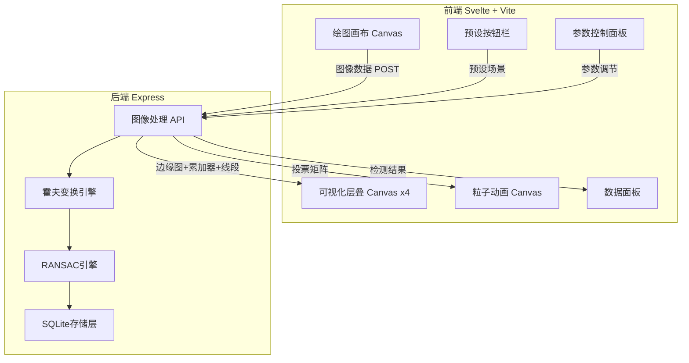
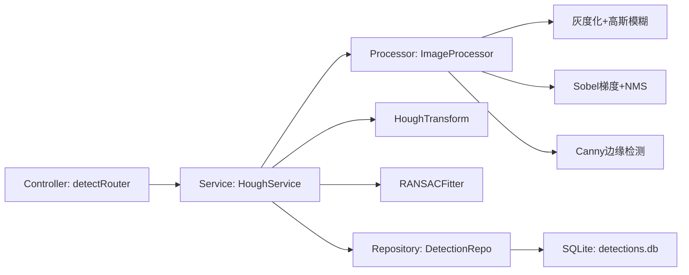
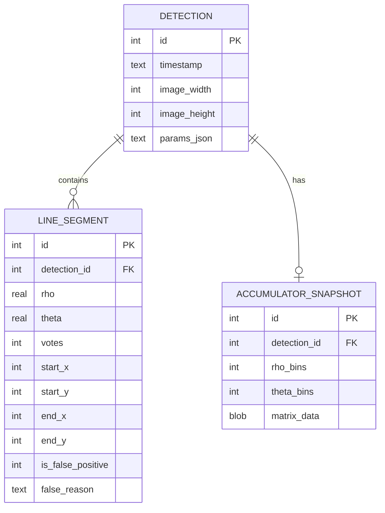

## 1. 架构设计



## 2. 技术说明

- 前端：Svelte 5 + Vite + TailwindCSS 4
- 初始化工具：Vite（svelte-ts 模板）
- 后端：Express 5 + TypeScript（ESM格式）
- 数据库：SQLite3（better-sqlite3 同步驱动）
- 端口：前端开发服务器 5173，后端 API 3010，Vite 代理到 3010

## 3. 路由定义

| 路由 | 用途 |
|------|------|
| / | 主页面，包含绘图、可视化、参数控制全部功能 |

## 4. API 定义

### 4.1 图像检测 API

```typescript
POST /api/detect
Request: {
  imageData: string       // base64 编码的 PNG 图像
  params: {
    cannyLow: number      // Canny 低阈值 (默认 50)
    cannyHigh: number     // Canny 高阈值 (默认 150)
    houghThreshold: number // 霍夫投票阈值 (默认 80)
    ransacIter: number    // RANSAC 迭代次数 (默认 100)
    ransacDist: number    // RANSAC 距离阈值 (默认 5)
    nmsWindow: number     // NMS 窗口大小 (默认 5)
  }
}
Response: {
  edges: number[]           // 边缘图 (0/1 扁平数组, width*height)
  accumulator: number[]     // 累加器矩阵 (rhoBins * thetaBins)
  rhoBins: number           // ρ 方向分箱数
  thetaBins: number         // θ 方向分箱数
  lines: Array<{
    rho: number             // 极坐标距离
    theta: number           // 极坐标角度(弧度)
    startX: number          // 线段起点X
    startY: number          // 线段起点Y
    endX: number            // 线段终点X
    endY: number            // 线段终点Y
    votes: number           // 得票数
    isFalsePositive: boolean // 是否误检
    falseReason?: string    // 误检原因
  }>
  imageWidth: number
  imageHeight: number
}
```

### 4.2 预设场景 API

```typescript
GET /api/presets/:name
Response: {
  imageData: string   // base64 预设图像
  description: string // 场景描述
}
```
预设名称: shadow-crack, road-crack, sharp-curve, multi-lane

### 4.3 历史记录 API

```typescript
GET /api/history
Response: Array<{
  id: number
  timestamp: string
  lines: Array<{ rho: number; theta: number; votes: number }>
  accumulatorSize: string
}>
```

## 5. 服务端架构图



## 6. 数据模型

### 6.1 数据模型定义



### 6.2 数据定义语言

```sql
CREATE TABLE IF NOT EXISTS detection (
    id INTEGER PRIMARY KEY AUTOINCREMENT,
    timestamp TEXT NOT NULL DEFAULT (datetime('now')),
    image_width INTEGER NOT NULL,
    image_height INTEGER NOT NULL,
    params_json TEXT NOT NULL
);

CREATE TABLE IF NOT EXISTS line_segment (
    id INTEGER PRIMARY KEY AUTOINCREMENT,
    detection_id INTEGER NOT NULL REFERENCES detection(id),
    rho REAL NOT NULL,
    theta REAL NOT NULL,
    votes INTEGER NOT NULL,
    start_x INTEGER NOT NULL,
    start_y INTEGER NOT NULL,
    end_x INTEGER NOT NULL,
    end_y INTEGER NOT NULL,
    is_false_positive INTEGER NOT NULL DEFAULT 0,
    false_reason TEXT
);

CREATE TABLE IF NOT EXISTS accumulator_snapshot (
    id INTEGER PRIMARY KEY AUTOINCREMENT,
    detection_id INTEGER NOT NULL REFERENCES detection(id),
    rho_bins INTEGER NOT NULL,
    theta_bins INTEGER NOT NULL,
    matrix_data BLOB NOT NULL
);

CREATE INDEX IF NOT EXISTS idx_line_segment_detection ON line_segment(detection_id);
CREATE INDEX IF NOT EXISTS idx_accumulator_detection ON accumulator_snapshot(detection_id);
```
