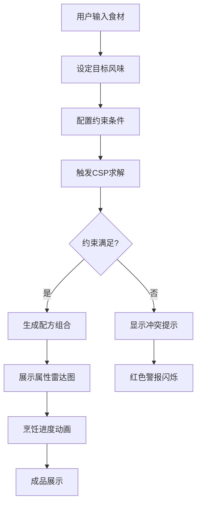

## 1. 产品概述
烹饪配方约束求解系统，用户输入现有食材与目标风味，系统通过约束满足问题（CSP）算法求解满足营养、口感与禁忌约束的配方组合。
- 主要用途：帮助用户在有限食材和约束条件下找到可行的烹饪配方
- 目标用户：烹饪爱好者、营养师、餐饮从业者
- 核心价值：通过CSP算法智能求解多约束下的最优配方组合，展示AI约束推理的可视化过程

## 2. 核心功能

### 2.1 用户角色
无需用户登录，单机使用模式

### 2.2 功能模块
1. **主页面**：食材选择、目标风味设定、约束配置、CSP求解器
2. **结果展示**：配方列表、属性雷达图、约束冲突提示
3. **预设场景**：四个预设烹饪难题一键加载
4. **数据库管理**：食材属性库、禁忌规则查看

### 2.3 页面详情
| 页面名称 | 模块名称 | 功能描述 |
|-----------|-------------|---------------------|
| 主页面 | 食材选择区 | 拖拽食材进入锅，展示抛物线动画 |
| 主页面 | 约束配置面板 | 设置营养、口感、禁忌约束 |
| 主页面 | 求解按钮 | 触发CSP算法求解 |
| 主页面 | 属性雷达图 | 展示配方营养属性，平滑过渡动画 |
| 主页面 | 约束冲突提示 | 红色警报闪烁动画 |
| 主页面 | 烹饪进度条 | 火焰燃烧动画 |
| 主页面 | 成品展示 | 光泽流转动画 |
| 预设场景 | 四个预设按钮 | 一键加载对应烹饪难题 |
| 预设场景 | 过敏原冲突 | 预设一 |
| 预设场景 | 营养超标 | 预设二 |
| 预设场景 | 火候时间悖论 | 预设三 |
| 预设场景 | 食材替代死锁 | 预设四 |

## 3. 核心流程
用户选择食材→设定目标风味→配置约束→触发求解→CSP算法处理→展示结果或冲突提示

## 4. 用户界面设计

### 4.1 设计风格
- 主色调：深橙色(#FF6B35)代表烹饪火焰，深绿色(#2D6A4F)代表新鲜食材
- 辅助色：深红色(#D62828)用于冲突警告，金色(#FFD60A)用于成功提示
- 按钮风格：圆角按钮，带阴影和微交互动画
- 字体：思源黑体，标题18-24px，正文14-16px
- 布局：卡片式布局，左侧食材库，中央烹饪区，右侧约束面板
- 图标风格：使用lucide图标库

### 4.2 页面设计概览
| 页面名称 | 模块名称 | UI元素 |
|-----------|-------------|-------------|
| 主页面 | 食材库 | 卡片网格，拖拽交互，悬停放大效果 |
| 主页面 | 烹饪锅 | 圆形锅具，食材落入抛物线动画 |
| 主页面 | 约束面板 | 滑块、开关、输入框，实时更新 |
| 主页面 | 雷达图 | SVG绘制，属性轴动态变化 |
| 主页面 | 进度条 | 火焰粒子动画，渐变填充 |
| 预设场景 | 按钮组 | 四个彩色按钮，图标+文字 |

### 4.3 响应式设计
桌面端优先，平板自适应，移动端基础可用
