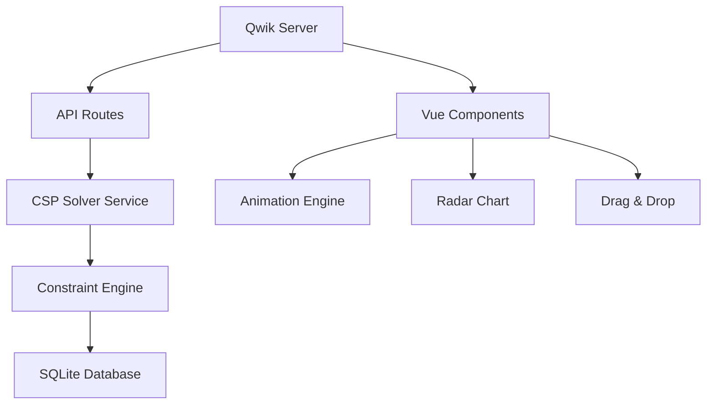
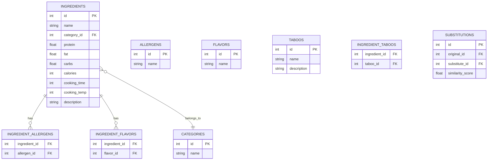

## 1. 架构设计
前后端一体化架构，Qwik作为全栈框架，集成Vue用于前端交互，SQLite存储数据



## 2. 技术说明
- 前端：Qwik City + Vue 3 + TypeScript
- 后端：Qwik Server Functions (Qwik自带服务端)
- 数据库：better-sqlite3 (同步SQLite驱动)
- CSP算法：自定义约束满足问题求解器
- 动画：CSS Animation + Vue Transition + Canvas粒子效果
- 图表：SVG原生绘制雷达图

## 3. 路由定义
| 路由 | 用途 |
|-------|------|
| / | 主页面，食材选择与配方求解 |
| /api/ingredients | 获取食材列表API |
| /api/solve | CSP求解API |
| /api/presets | 获取预设场景API |

## 4. API定义
```typescript
// 食材数据结构
interface Ingredient {
  id: number;
  name: string;
  category: string;
  nutrition: {
    protein: number;
    fat: number;
    carbs: number;
    calories: number;
  };
  flavor: string[];
  allergens: string[];
  cookingTime: number; // 分钟
  cookingTemp: number; // 温度
}

// 约束条件
interface Constraints {
  maxCalories: number;
  maxProtein: number;
  maxFat: number;
  maxCarbs: number;
  targetFlavors: string[];
  forbiddenIngredients: number[];
  maxCookingTime: number;
  minCookingTemp: number;
  maxCookingTemp: number;
}

// 求解请求
interface SolveRequest {
  availableIngredients: number[];
  constraints: Constraints;
  targetFlavor: string;
}

// 求解结果
interface SolveResult {
  success: boolean;
  recipe: {
    ingredients: { id: number; ratio: number }[];
    cookingTime: number;
    cookingTemp: number;
    nutrition: { protein: number; fat: number; carbs: number; calories: number };
  } | null;
  conflicts: string[];
  searchStats: {
    nodesExplored: number;
    timeTaken: number;
    solutionsFound: number;
  };
}
```

## 5. 数据模型

### 5.1 数据模型定义


### 5.2 数据定义语言
```sql
-- 食材分类表
CREATE TABLE IF NOT EXISTS categories (
  id INTEGER PRIMARY KEY AUTOINCREMENT,
  name TEXT NOT NULL UNIQUE
);

-- 食材表
CREATE TABLE IF NOT EXISTS ingredients (
  id INTEGER PRIMARY KEY AUTOINCREMENT,
  name TEXT NOT NULL,
  category_id INTEGER REFERENCES categories(id),
  protein REAL DEFAULT 0,
  fat REAL DEFAULT 0,
  carbs REAL DEFAULT 0,
  calories INTEGER DEFAULT 0,
  cooking_time INTEGER DEFAULT 10,
  cooking_temp INTEGER DEFAULT 180,
  description TEXT
);

-- 过敏原表
CREATE TABLE IF NOT EXISTS allergens (
  id INTEGER PRIMARY KEY AUTOINCREMENT,
  name TEXT NOT NULL UNIQUE
);

-- 食材过敏原关联表
CREATE TABLE IF NOT EXISTS ingredient_allergens (
  ingredient_id INTEGER REFERENCES ingredients(id),
  allergen_id INTEGER REFERENCES allergens(id),
  PRIMARY KEY (ingredient_id, allergen_id)
);

-- 风味表
CREATE TABLE IF NOT EXISTS flavors (
  id INTEGER PRIMARY KEY AUTOINCREMENT,
  name TEXT NOT NULL UNIQUE
);

-- 食材风味关联表
CREATE TABLE IF NOT EXISTS ingredient_flavors (
  ingredient_id INTEGER REFERENCES ingredients(id),
  flavor_id INTEGER REFERENCES flavors(id),
  PRIMARY KEY (ingredient_id, flavor_id)
);

-- 禁忌表
CREATE TABLE IF NOT EXISTS taboos (
  id INTEGER PRIMARY KEY AUTOINCREMENT,
  name TEXT NOT NULL,
  description TEXT
);

-- 食材禁忌关联表
CREATE TABLE IF NOT EXISTS ingredient_taboos (
  ingredient_id INTEGER REFERENCES ingredients(id),
  taboo_id INTEGER REFERENCES taboos(id),
  PRIMARY KEY (ingredient_id, taboo_id)
);

-- 食材替代表
CREATE TABLE IF NOT EXISTS substitutions (
  id INTEGER PRIMARY KEY AUTOINCREMENT,
  original_id INTEGER REFERENCES ingredients(id),
  substitute_id INTEGER REFERENCES ingredients(id),
  similarity_score REAL DEFAULT 0.5
);

-- 预设场景表
CREATE TABLE IF NOT EXISTS presets (
  id INTEGER PRIMARY KEY AUTOINCREMENT,
  name TEXT NOT NULL,
  description TEXT,
  config TEXT NOT NULL
);

-- 创建索引
CREATE INDEX IF NOT EXISTS idx_ingredients_category ON ingredients(category_id);
CREATE INDEX IF NOT EXISTS idx_ingredient_allergens ON ingredient_allergens(ingredient_id);
CREATE INDEX IF NOT EXISTS idx_ingredient_flavors ON ingredient_flavors(ingredient_id);
CREATE INDEX IF NOT EXISTS idx_substitutions ON substitutions(original_id);
```
